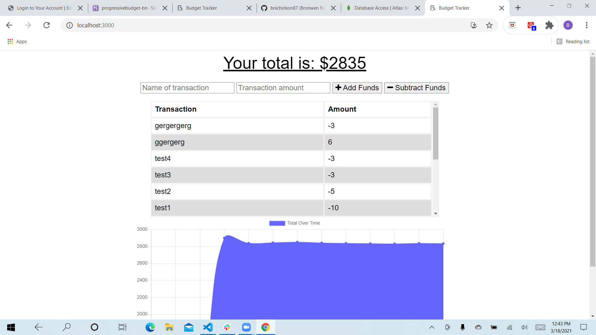

# ProgressiveBudget

  An app where you can keep track of the money you earn and spend

  # Table of Contents:
  *[Installation](#installation)
  *[Usage](#usage)
  *[Test](#test)
  *[Contributions](#contributions)
  *[Questions](#questions)
  *[License](#license)
  
  
  ## Installation 
  
  Express, morgan, mongoose and compression are required
  
  ## Usage
  
 You type in the amount of money you have received or spent (and for what), and the app will tell you how much money you have available.  It will also show you on a graph.

 ## Test

 By running it to make sure it works
  
  ## Contributions
  
  Individual assignment

  ## License
  
  None

  Screenshot: 

  https://github.com/bnicholson87/ProgressiveBudget.git
  https://progressivebudget-bn.herokuapp.com/
